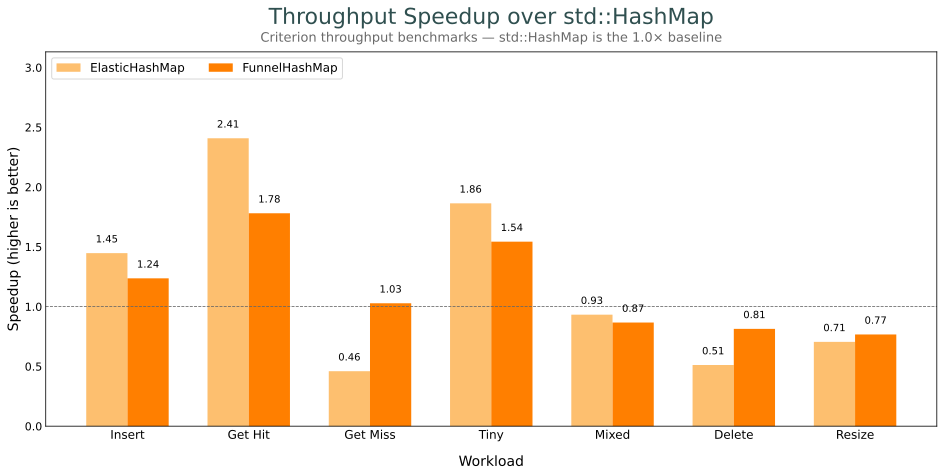
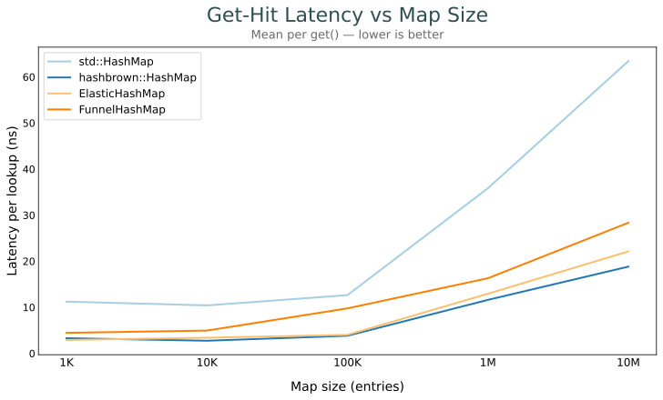
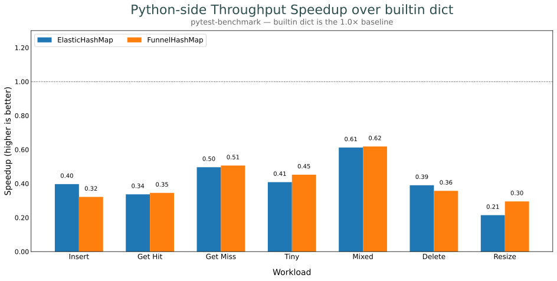

# Benchmarks

Methodology + commands in [AGENTS.md](../AGENTS.md), and at the top of each benchmark file.

## Naming convention

CodSpeed keys each benchmark by its Criterion URI and shows the last segment:

```
benches/<file>.rs::<group-const>::<bench-fn>::<benchmark_group>::<bench-id>
```

Renaming any segment orphans the old benchmark — history resets, but CI still
passes (only benchmarks in both base and PR are diffed). Keep changes additive.

For the CodSpeed-tracked suite (`speedup.rs`):

- **Bench id `<workload>_<impl>`**, globally unique, `impl ∈ {std, hashbrown,
  elastic, funnel}` (e.g. `get_hit_elastic`). Fold variants into the workload so
  ids don't collide: `get_hit_load_50_elastic`, `get_hit_big_elastic`.
- **`benchmark_group` = `<workload>`, bench fn = `bench_<workload>`** — no
  `_throughput` suffix.
- **New workload**: add a `bench_<workload>` fn (via `bench_all_impls!`) to the
  `benches` group; never rename an existing one. Add it to `WORKLOADS` in
  [generate_speedup_chart.py](../scripts/generate_speedup_chart.py) and keep
  `IMPLEMENTATIONS` in [_plot_common.py](../scripts/_plot_common.py) in sync.

The local-only `mean_latency.rs` suite isn't uploaded to CodSpeed but uses the
same tokens: it emits `get_hit_latency_<size>_<impl>` Criterion ids. No CodSpeed
history here, so renaming is free.

## Throughput (Rust, vs `std::HashMap`)



## Mean latency by map size (Rust)



## Python bindings vs builtin `dict`


